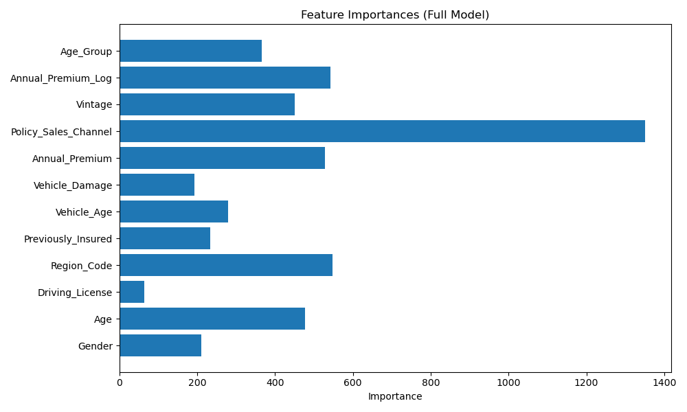
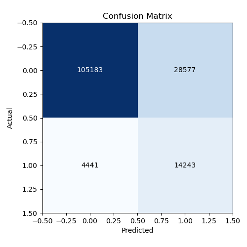

# 健康保險交叉銷售預測系統

基於機器學習的健康保險交叉銷售預測系統，用於分析客戶特徵並預測客戶購買車輛保險的可能性。

## 項目架構

該項目採用前後端分離架構：

### 後端

- 使用Python Flask構建RESTful API
- 使用XGBoost機器學習模型進行預測
- 提供數據分析、模型訓練和預測功能

### 前端

- 使用React + TypeScript構建用戶界面
- 使用Tailwind CSS和shadcn UI設計風格
- 整合D3.js交互式數據可視化

## 主要功能

1. **數據分析儀表板**：展示客戶數據分布和模型性能指標
2. **進階交互式可視化**：使用D3.js實現的氣泡圖、區域圖和儀表盤
3. **單筆預測**：根據單個客戶信息進行預測
4. **批量預測**：支持CSV文件上傳進行批量預測
5. **預測歷史記錄**：查看和管理歷史預測結果

## 技術亮點

- **交互式數據可視化**：使用D3.js實現豐富的交互體驗
- **響應式設計**：適配桌面和移動設備
- **高性能機器學習模型**：使用XGBoost達到高準確率和可解釋性
- **用戶友好界面**：採用現代設計風格提升用戶體驗

## 安裝與運行

### 後端

```bash
cd insurance-cross-sell-app/backend
pip install -r requirements.txt
python app.py
```

### 前端

```bash
cd insurance-cross-sell-app/frontend
npm install
npm run dev
```

## 項目截圖




## 許可證

MIT License 